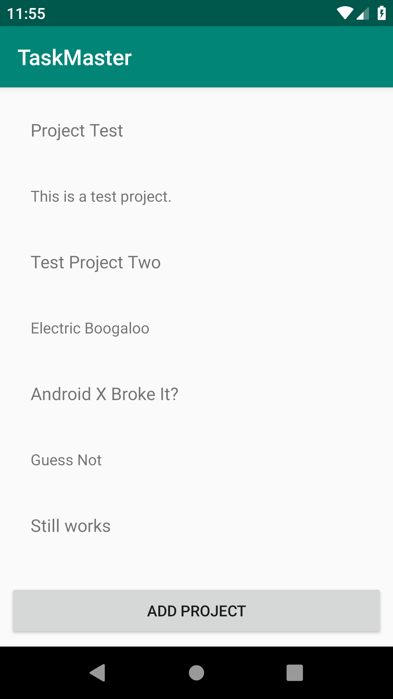
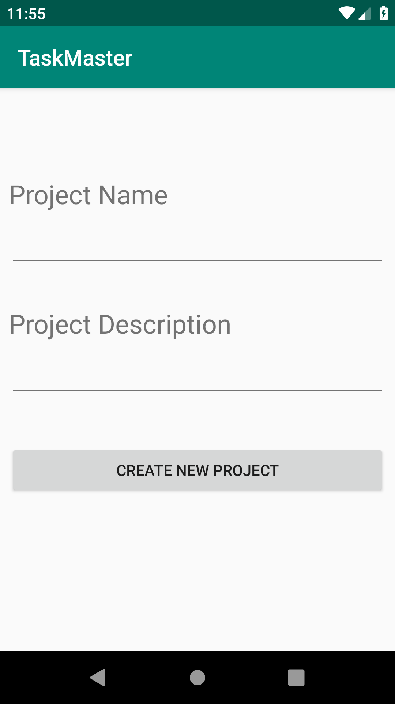
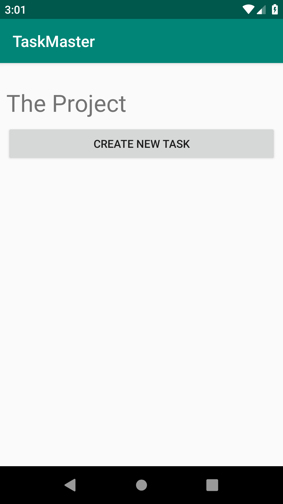
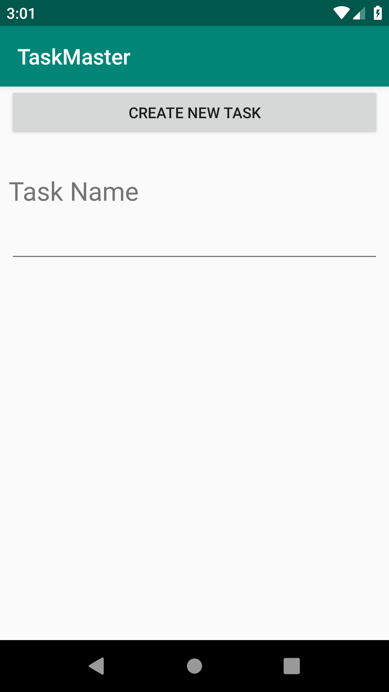

## TASKMASTER APP

### Purpose:

This is an application designed to be a kanban board. A user should be able to add projects and then add tasks to those projects. These should be stored locally.

### Running the app:

Install on phone and open it.

### Screenshots

