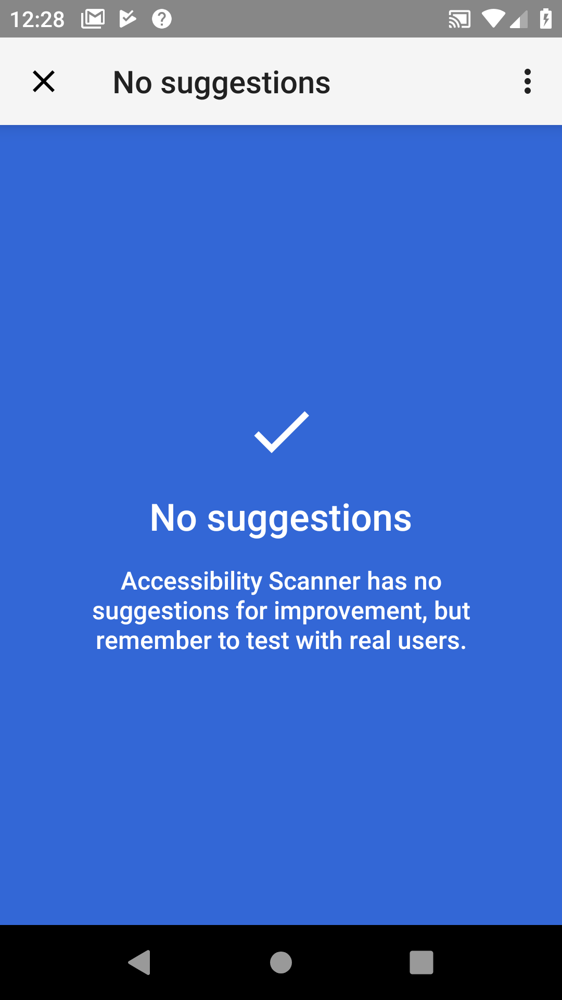

## TASKMASTER APP

### Purpose:

This is an application designed to be a kanban board. A user should be able to add projects and then add tasks to those projects. These should be stored locally.

### Running the app:

Install on phone and open it.

### Screenshots

### Accessibility

#### Previous Suggestions Made By Accessibility Scanner:

Darken the input fields to improve contrast - Completed

Darken text views to improve contrast - Completed

Shorten content descriptions to contain important information - Completed

Remove content descriptions from input fields and allow hints to be used - Completed

Increase size of input fields to help with clickability - Completed

Increase size of buttons for viewing projects to help with clickability - Completed

#### Changes Not Suggested:

Change project list items to being focusable - Completed

Add content description to button for viewing projects - Completed